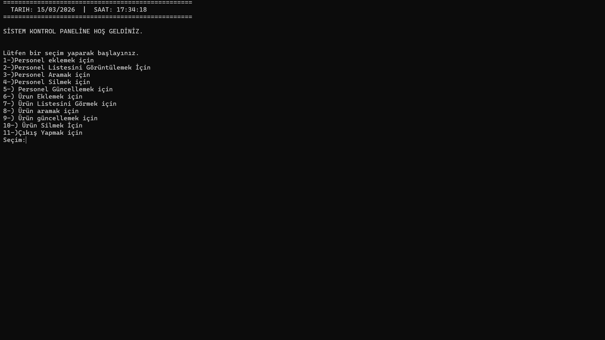
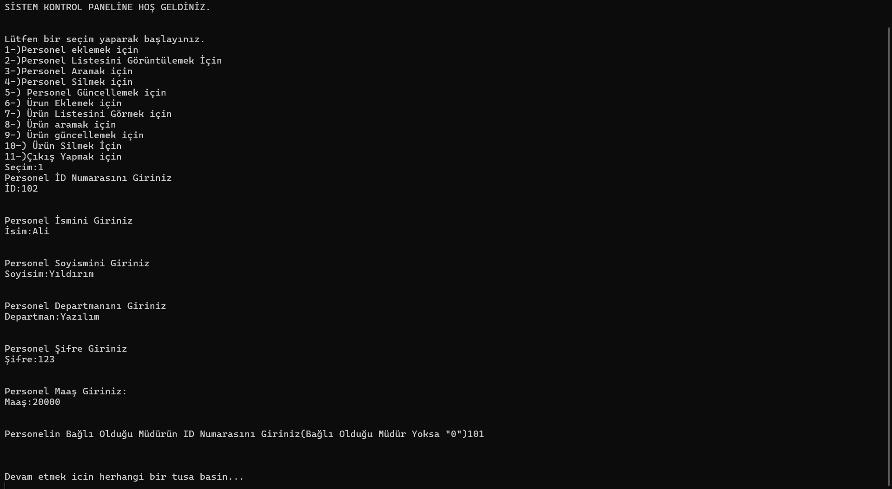
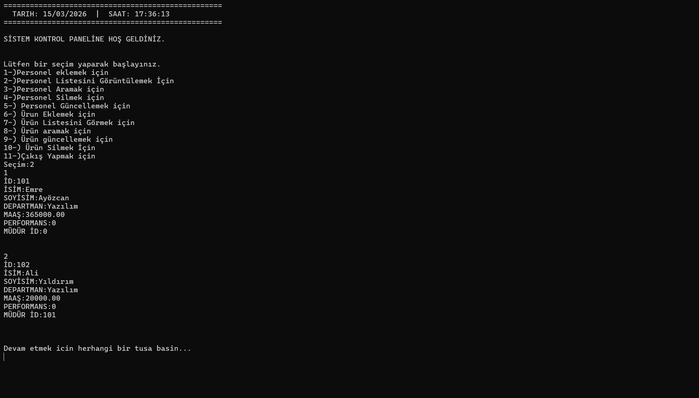

# C-Corp ERP Yönetim Sistemi

C-Corp ERP Yönetim Sistemi, c Programlama dilinde sıfırdan geliştirdiğim bir projedir. Projem CMD tabanlı olup, şirket içi personel ve ürün takibi yapılabilen bir ERP sistemidir

## Özellikler

- **Personel Yönetimi (HR Modülü):** Personel ekleme, listeleme, dinamik arama (ID, İsim, Departman bazlı), silme ve esnek bilgi güncelleme.

- **Ürün ve Stok Yönetimi (Envanter Modülü):** Yeni ürün kaydı, kategori ve fiyat takibi, personele zimmetleme yeteneği ve stok durumu güncellemeleri.

- **Kalıcı Veri Depolama (File I/O):** Sistem kapatılırken tüm verilerin `personelKayitlari.txt` ve `urunKayitlari.txt` dosyalarına yedeklenmesi ve sistem açılışında otomatik olarak belleğe geri yüklenmesi.

- **Gelişmiş Kullanıcı Arayüzü (UX):**
  - Tam UTF-8 Türkçe karakter desteği.
  - Dinamik sistem saati ve tarihi entegrasyonu.
  - Ekran temizleme ve işlem adımlarında akıllı duraklatma (pause) mekanizmaları.
  - Yanlışlıkla silmelere karşı "ONAY" koruma kalkanı.
  - Veri güncelleme ekranlarında boş geçerek (Enter) mevcut veriyi koruma özelliği.

  
## Mimari ve Teknik Detaylar (Tech Stack)

- **Dil:** C
- **Veri Yapısı:** Çift Yönlü Bağlı Liste (Doubly Linked List)
- **Bellek Yönetimi:** Dinamik Tahsis (`malloc`, `free`)
- **Modüler Yapı:** Proje, okunabilirliği artırmak ve bakımı kolaylaştırmak için 5 temel modüle (`main`, `personel`, `urun`, `dosya`, `tools`) ve özel veri tiplerinin tutulduğu başlık dosyalarına (`structs.h`) ayrılmıştır.

- **Girdi İşleme:** Güvenli veri girişi için `scanf` ve esnek metin manipülasyonları için `fgets` & `strcspn` kombinasyonları kullanılmıştır.

### Kullanılan Kütüphaneler

Projeyi geliştirirken C dilinin standart kütüphanelerinin yanı sıra, işletim sistemine özgü bazı kütüphanelerden de faydalanılmıştır:

- `<stdio.h>`: Temel giriş/çıkış (printf, scanf) ve dosya okuma/yazma (File I/O) işlemleri için kullanıldı.

- `<stdlib.h>`: Dinamik bellek tahsisi (`malloc`, `free`), veri tipi dönüşümleri (`atoi`, `atof`) ve sistem komutları (`system("cls")`) için kullanıldı.

- `<string.h>`: Metin (string) kopyalama, karşılaştırma ve formatlama (`strcpy`, `strcmp`, `strcspn`) operasyonları için entegre edildi.

- `<windows.h>`: Konsolun dil kodlamasını UTF-8 (65001) olarak ayarlayarak tam Türkçe karakter desteği sağlamak için kullanıldı.
- `<time.h>`: Sistemin ana menüsünde yer alan anlık tarih ve saat panelinin veri motoru olarak kullanıldı.

- **Özel Başlık Dosyaları (Custom Headers):** Modüler yapıyı birbirine bağlamak için projenin kendi içinde üretilen `structs.h`, `personel.h`, `urun.h`, `dosya.h` ve `tools.h` dosyaları kullanıldı.

  
## Kullanım/Örnekler
Program ana menüsü üzerinden sistem iki ana modüle ayrılır ve aşağıdaki işlemler gerçekleştirilebilir:

1. **Personel Yönetimi (İnsan Kaynakları):**
   - **Ekle / Sil / Güncelle:** Yeni personel kaydı açar, mevcut personelin departman, maaş veya müdür bilgilerini esnek bir şekilde günceller ya da sistemden kalıcı olarak siler.
   - **Ara / Listele:** Tüm çalışanları detaylarıyla ekrana döker veya spesifik bir personeli ID, isim ya da departman bilgisine göre sorgular.

2. **Ürün ve Stok Yönetimi (Envanter):**
   - **Ekle / Sil / Güncelle:** Yeni ürünleri stoka dahil eder, stok adedi ve fiyat güncellemelerini yapar.
   - **Zimmetleme:** Sistemdeki bir ürünü, o ürünü kullanan personelin ID'si ile eşleştirerek (zimmetliPersonelid) takip edilmesini sağlar.
   - **Ara / Listele:** Depodaki tüm ürünleri listeler veya kategori ve ürün adına göre akıllı arama yapar.

  
## Ekran Görüntüleri

### Ekran Görüntüleri

#### 1. Sisteme Giriş ve Veri Yükleme

#### 2. Ana Kontrol Paneli ve Canlı Saat

#### 3. Personel Kayıt Ekranı

#### 4. Dinamik Personel Listeleme

  
## Yazar

 

  
